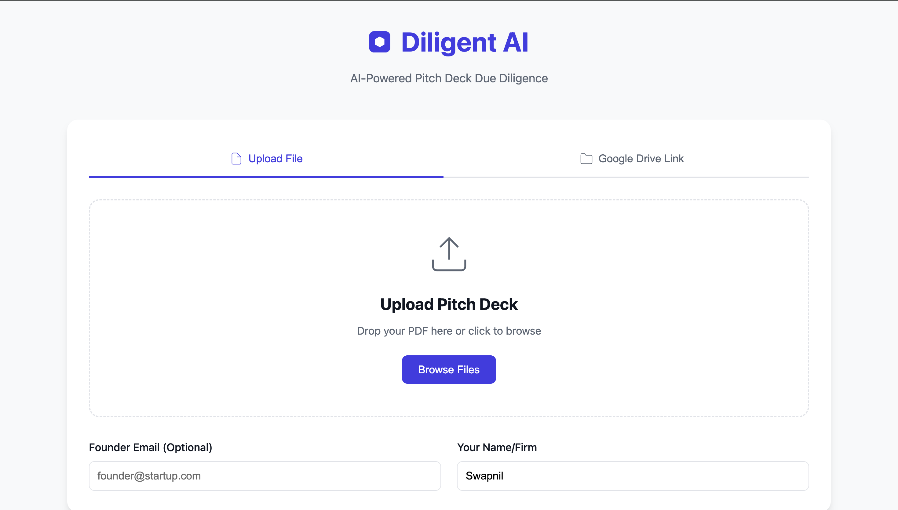
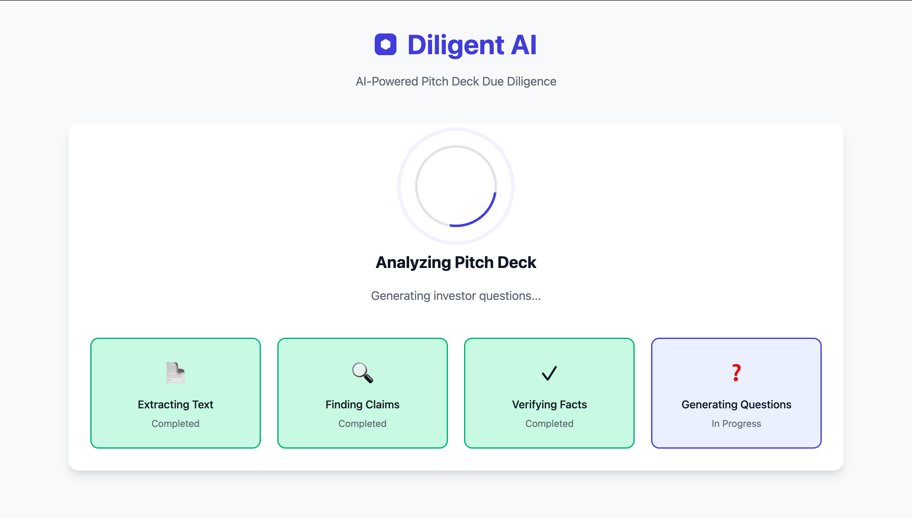
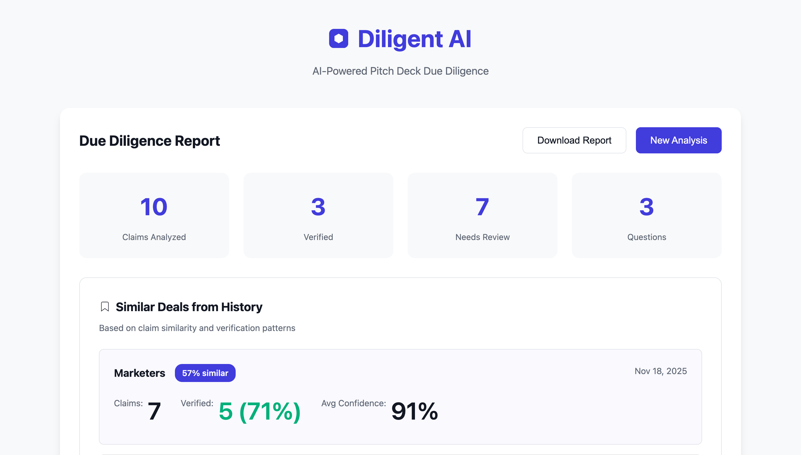
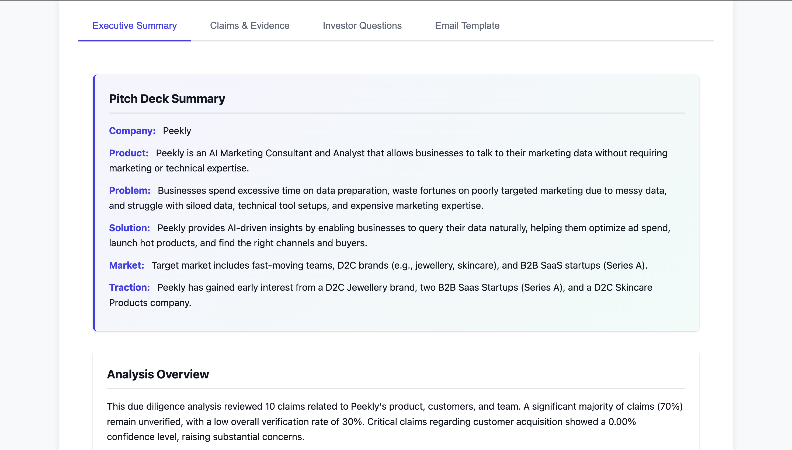
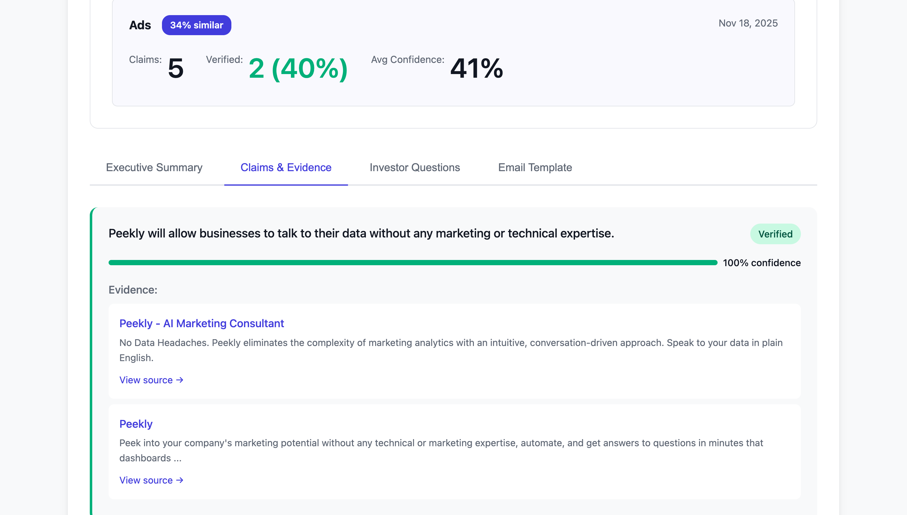
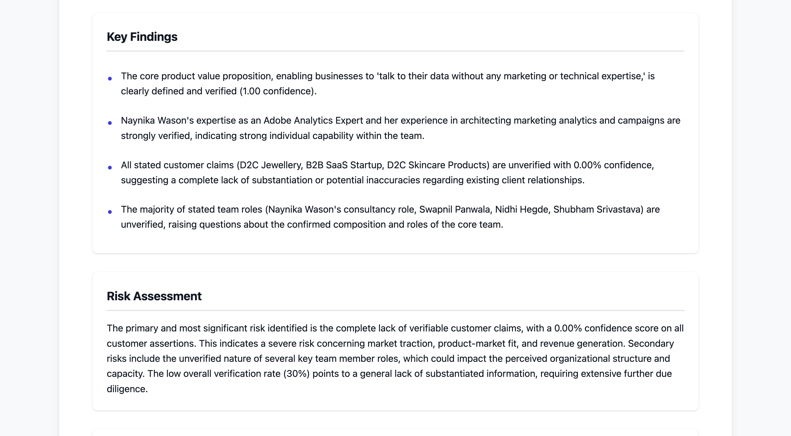
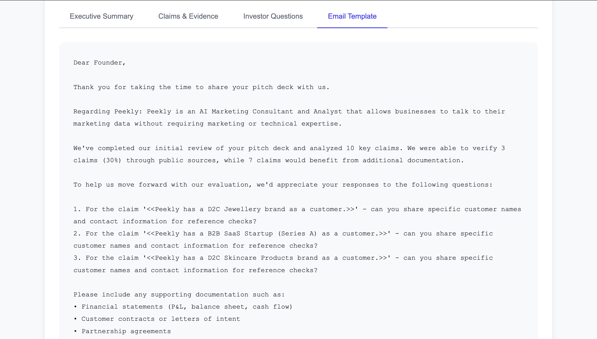

# Diligent AI

**AI-powered due diligence for investors**

Automatically verify pitch deck claims, find similar past deals, and generate personalized investor questions—all from a Google Drive link or file upload.

---

## Sample Inputs and Outputs

Below are screenshots from a real analysis run, showing the complete workflow from input to final email template.

### Input Screen

*Upload a pitch deck PDF or paste a Google Drive link to start the analysis*

### Analysis Process

*Real-time progress tracking through the 4-step verification process*

### Report Overview

*Executive summary with key findings, risk assessment, and recommendation*

### Detailed Analysis

*AI-generated company summary extracted from the pitch deck*


*Verified claims with supporting evidence from high-quality sources*


*Structured analysis with identified risks and investment recommendation*

### Email Template

*Auto-generated professional email with context-aware investor questions*

---

## Core Design Principles

This project is built on three fundamental principles:

### 1. Seamless Integration —> No New Apps Required

**Implemented:**
- **Google Drive**: Paste a shared link, get instant verification
- **Web UI**: Drag-drop files or paste Drive links in your browser
- **CLI**: Command-line interface for automation

### 2. Hyper-Personalization —> Context-Aware Intelligence

**Implemented:**
- **Memory Agent**: Automatically stores all analyzed pitch decks
- **Similar Deals**: Shows top 3 similar past deals with comparison metrics
- **Smart Context**: "You reviewed a similar fintech pitch 2 weeks ago with 80% verification rate"

### 3. True Agency —> Execution, Not Just Data

**Implemented:**
- Automatically verifies all claims using web evidence
- Generates prioritized investor questions
- Composes ready-to-send email templates
- Stores deals in memory without user intervention

**Roadmap:** Gmail bot, Slack bot, Auto-send emails, proactive monitoring, Vector embeddings, pattern recognition (see [ROADMAP.md](ROADMAP.md))

---

## Quick Start (5 Minutes)

### 1. Install & Configure

```bash
# Create virtual environment
python -m venv venv
source venv/bin/activate  # On Windows: venv\Scripts\activate

# Install dependencies
pip install -r requirements.txt

# Configure API keys in .config.yaml
cp .config.yaml.example .config.yaml
# Edit .config.yaml with your Gemini and SerpAPI keys
```

### 2. Start Web Server

```bash
cd web
python server.py
```

Open: **http://localhost:8000**

### 3. Test Google Drive Integration

1. Upload a pitch deck PDF to Google Drive
2. Share → "Anyone with the link can view"
3. Click **"Google Drive Link"** tab in the web UI
4. Paste the link → Click **"Analyze Deck"**
5. Watch the 4-step verification process
6. View results: claims, evidence, questions, email

### 4. Test Memory Agent

Analyze 2+ pitch decks (upload or Drive links), then check the **"Similar Deals from History"** section to see personalized comparisons.

---

## How It Works

```
Input (PDF or Drive Link)
    ↓
1. Extract text from PDF
    ↓
2. Identify verifiable claims using AI agent
   (Filters out opinions, marketing language, and vague statements)
    ↓
3. Search web for evidence (SerpAPI)
   (Filters low-quality sources like social media)
    ↓
4. Verify claims with LLM (Gemini) + confidence scores
    ↓
5. Generate executive summary
   (Overview, key findings, risk assessment, recommendation)
    ↓
6. Find similar past deals (Memory Agent)
    ↓
7. Generate intelligent investor questions
   (Context-aware, not generic "provide documents" questions)
    ↓
8. Compose professional email template
    ↓
Output: Executive summary + verified claims + questions + email
```

---

## Features

### Current Implementation

| Feature | Status | Description |
|---------|--------|-------------|
| **PDF Upload** | ✅ Working | Drag-drop or browse for files |
| **Google Drive** | ✅ Working | Paste Drive link for instant verification |
| **AI Claim Extraction** | ✅ Enhanced | Intelligent filtering of verifiable claims (excludes opinions & marketing) |
| **Evidence Filtering** | ✅ New | Filters low-quality sources (social media, personal blogs) |
| **Executive Summary** | ✅ New | Auto-generated overview, findings, risks, and recommendation |
| **Claim Verification** | ✅ Working | Auto-verifies with web evidence + confidence scores |
| **Memory Agent** | ✅ Working | Stores all deals in SQLite, finds similar matches |
| **Similar Deals** | ✅ Working | Shows top 3 similar past deals with comparison |
| **Smart Questions** | ✅ Enhanced | Context-aware questions (not generic "provide documents") |
| **Email Template** | ✅ Enhanced | Professional, personalized email with analysis context |
| **Web UI** | ✅ Working | Beautiful interface with summary tab + real-time progress |
| **REST API** | ✅ Working | `/api/analyze`, `/api/deals`, `/api/stats` |

### Architecture

```
diligent-ai/
├── diligent_ai/          # Core Python package
│   ├── drive_utils.py    # ✨ Google Drive integration
│   ├── memory_agent.py   # ✨ Memory & similarity matching
│   ├── pdf_utils.py      # PDF text extraction
│   ├── llm_client.py     # Gemini LLM client
│   ├── evidence.py       # SerpAPI search
│   ├── verifier.py       # Claim verification
│   ├── agent.py          # Question generation
│   └── cli.py            # Command-line interface
│
├── web/                  # Flask web server
│   ├── server.py         # ✨ REST API + memory endpoints
│   ├── index.html        # ✨ Tabbed UI + similar deals
│   ├── app.js            # ✨ Drive link + similarity display
│   └── style.css         # UI styling
│
├── data/
│   └── memory.db         # ✨ SQLite database (auto-created)
│
└── tests/                # Unit tests
```

---

## API Endpoints

### `POST /api/analyze`

Analyze a pitch deck (file upload or Google Drive link).

**Request (File Upload):**
```bash
curl -X POST http://localhost:8000/api/analyze \
  -F "pdf=@deck.pdf" \
  -F "founder_email=founder@startup.com" \
  -F "investor_name=Jane Smith"
```

**Request (Google Drive):**
```bash
curl -X POST http://localhost:8000/api/analyze \
  -H "Content-Type: application/json" \
  -d '{
    "drive_link": "https://drive.google.com/file/d/FILE_ID/view",
    "founder_email": "founder@startup.com",
    "investor_name": "Jane Smith"
  }'
```

**Response:**
```json
{
  "summary": {
    "overview": "Analyzed 12 claims with 75% verification rate...",
    "key_findings": [
      "Revenue claims verified with public sources",
      "Customer count could not be independently verified"
    ],
    "risk_assessment": "Moderate risk due to unverified customer claims",
    "recommendation": "Proceed with Due Diligence",
    "statistics": {
      "total_claims": 12,
      "verified": 9,
      "unverified": 3,
      "disputed": 0,
      "average_confidence": 0.75
    }
  },
  "claims": [
    {
      "claim": "We have 500 enterprise customers",
      "status": "verified",
      "confidence": 0.9,
      "category": "customer",
      "evidence": [
        {
          "source": "web",
          "url": "https://techcrunch.com/...",
          "snippet": "The company announced 500+ customers...",
          "quality_score": 3
        }
      ]
    }
  ],
  "questions": [
    "Regarding 'We have 500 enterprise customers' - can you share specific customer names and contact information for reference checks?",
    "What is the methodology behind your revenue projections and growth metrics?"
  ],
  "email": "Dear Founder,\n\nThank you for sharing your pitch deck...",
  "similar_deals": [
    {
      "company_name": "Similar Corp",
      "similarity_score": 0.78,
      "verified_claims": 10,
      "total_claims": 12
    }
  ]
}
```

### `GET /api/deals`

List all analyzed deals (paginated).

```bash
curl http://localhost:8000/api/deals?limit=20&offset=0
```

### `GET /api/deals/<id>`

Get full details for a specific deal.

```bash
curl http://localhost:8000/api/deals/1
```

### `GET /api/stats`

Overall statistics across all deals.

```bash
curl http://localhost:8000/api/stats
```

---

## Key Improvements

### 1. Executive Summary Generation

Every analysis now includes an AI-generated executive summary with:

- **Overview**: High-level assessment of the pitch deck
- **Key Findings**: 3-5 most important discoveries (positive and concerning)
- **Risk Assessment**: Identified risks based on unverified or disputed claims
- **Recommendation**: Clear investment decision guidance
  - "Proceed with Due Diligence"
  - "Proceed with Caution"
  - "Do Not Proceed"
- **Statistics**: Verification metrics and confidence scores

### 2. Enhanced Claims Analysis

**Intelligent Claim Extraction:**
- AI agent filters out opinions, marketing language, and vague statements
- Focuses on verifiable, material claims (financial, customer, market, product, team)
- Categorizes each claim for better organization

**Evidence Quality Filtering:**
- Blacklists low-quality sources (social media, personal blogs, forums)
- Prioritizes high-quality sources (Crunchbase, TechCrunch, Bloomberg, SEC filings)
- Quality scoring system ranks evidence by reliability
- Requests 2x evidence and filters to top N results

**Filtered Domains:**
- ❌ Pinterest, Facebook, Twitter, Instagram, YouTube
- ❌ Reddit, Quora, personal LinkedIn posts
- ✅ Crunchbase, TechCrunch, Bloomberg, Reuters, WSJ, Forbes
- ✅ Official SEC filings, news outlets

### 3. Intelligent Investor Questions

**Context-Aware Question Generation:**
- No more generic "Can you provide supporting documents for" questions
- Specific, probing questions based on actual analysis findings
- Prioritizes high-risk areas (disputed claims, low confidence scores)
- Asks about methodology, data sources, and verification details

**Example Improvements:**
```
Before: "Can you provide supporting documents for: We have 500 customers"
After:  "Regarding 'We have 500 enterprise customers' - can you share specific
         customer names and contact information for reference checks?"

Before: "Please share revenue breakdown and supporting docs"
After:  "What is the methodology behind your 300% YoY revenue growth claim?
         Can you provide monthly revenue data with bank statements?"
```

### 4. Professional Email Templates

**Enhanced Email Formatting:**
- Warm, professional tone with context
- Includes analysis summary statistics
- Numbered questions for easy reference
- Offers NDA if needed
- Emphasizes urgency and momentum

**Structure:**
1. Greeting and positive acknowledgment
2. Analysis context (claims analyzed, verification rate)
3. Numbered questions with clear formatting
4. Request for supporting documentation
5. NDA offer and timeline expectations
6. Professional closing

---

## Example Use Cases

### Use Case 1: Investor Reviews Pitch Deck from Email

**Scenario:** Investor receives pitch deck PDF via email attachment.

**Current Workflow (Manual):**
1. Download PDF
2. Read through 20+ pages
3. Google each claim manually
4. Take notes on what to verify
5. Draft email questions
6. **Total time: 2-3 hours**

**With Diligent AI:**
1. Forward email attachment to Google Drive
2. Share Drive link → Paste in Diligent AI
3. Get verification report in 30 seconds
4. Copy email template → Send
5. **Total time: 2 minutes**

### Use Case 2: Pattern Recognition Across Deals

**Scenario:** Investor has analyzed 50+ pitch decks over 6 months.

**Current Workflow (Manual):**
- No systematic way to compare deals
- Relies on memory to spot similar companies
- Cannot identify patterns in successful investments

**With Diligent AI:**
- Every deal stored automatically
- Similar deals surfaced with each new analysis
- Can query: "Show me all fintech deals with unverified revenue claims"
- Identifies patterns: "Companies with 80%+ verification rate had 3x higher investment success"

---

## Documentation

- **[QUICKSTART.md](QUICKSTART.md)** — 5-minute testing guide
- **[ROADMAP.md](ROADMAP.md)** — Future features (Gmail/Slack bots, vector embeddings)
- **[web/README.md](web/README.md)** — Web UI technical details

---

## Tech Stack

| Component | Technology | Purpose |
|-----------|-----------|---------|
| **Backend** | Python 3.13 + Flask | REST API server |
| **Frontend** | HTML/CSS/JavaScript | Web UI |
| **Workflow Engine** | LangGraph | Agent orchestration & state management |
| **LLM** | Google Gemini | Claim extraction & verification |
| **Search** | SerpAPI | Web evidence retrieval |
| **Database** | SQLite | Deal storage & similarity matching |
| **PDF Processing** | pypdf | Text extraction |

### LangGraph Workflow Architecture

The analysis pipeline uses **LangGraph** for orchestrating the multi-step agent workflow:

```
1. generate_pitch_deck_summary → Extract company info (parallel start)
2. extract_claims → Identify verifiable claims from deck
3. verify_claims → Search SerpAPI + verify each claim with LLM
4. generate_questions → Create context-aware investor questions
5. compose_email → Generate personalized email template
6. generate_executive_summary → Create final analysis report
```

**Benefits:**
- **State Management**: Shared state across all nodes (text, claims, evidence, questions)
- **Error Handling**: Graceful fallbacks when API calls fail
- **Modularity**: Each step is an independent, testable function
- **Flexibility**: Easy to add new nodes or modify the workflow graph

---

## Limitations & Future Work

### Current Limitations

1. **Similarity Matching:** Uses keyword overlap (simple). Upgrade to vector embeddings for semantic similarity.
2. **Database:** SQLite (single-file). Migrate to PostgreSQL for production scale.
3. **Public Drive Links Only:** Requires "Anyone with the link" sharing. OAuth support implemented but requires credentials.

### Next Steps (See [ROADMAP.md](ROADMAP.md))

- [ ] Gmail bot (auto-detect pitch deck attachments)
- [ ] Slack bot (listen for uploads in #deal-flow)
- [ ] Vector embeddings (Pinecone/Weaviate for semantic search)
- [ ] Proactive monitoring (re-verify claims when new evidence appears)

---

## Recent Improvements (November 2025)

### Bug Fixes & Enhancements

**Fixed Critical JSON Parsing Issue:**
- Added `clean_json_response()` helper function to handle Gemini's markdown-wrapped JSON responses
- Applied fix across all modules: `workflow.py`, `agent.py`, `verifier.py`
- Pitch deck summary now extracts correctly (previously showed "Not specified")
- Claims extraction now working properly (8+ claims extracted per typical pitch deck)
- All LLM response parsing now handles markdown code blocks (` ```json ... ``` `)

**Improved LangGraph Workflow:**
- Enhanced error handling with descriptive error messages
- Better claim filtering to avoid extracting slide formatting text
- Verified evidence extraction through SerpAPI (filters mock/placeholder data)
- Context-aware investor questions (no generic "provide documents" questions)
- Executive summary generation with real analysis insights

**Test Results:**
- ✅ Pitch deck summary extraction: Working
- ✅ Claims extraction: 8+ claims per deck
- ✅ Evidence verification: Real SerpAPI results
- ✅ Investor questions: Context-aware and specific
- ✅ Executive summary: Proper analysis with recommendations
- ✅ Email template: Includes company context and statistics

**How to Test:**
```bash
source venv/bin/activate
python -m diligent_ai.cli example/sample.pdf --config .config.yaml
```

---

## License

MIT License - See LICENSE file for details

---

## Contributing

This is an open-source project. For questions or feedback, please open an issue or contact the maintainer.

---

## Why Diligent AI?

**Problem:** Investors waste hours manually fact-checking pitch decks, often missing red flags or asking generic questions.

**Solution:** Diligent AI automates verification, integrates into existing workflows (Gmail, Slack, Drive), learns from every interaction, and takes autonomous action.

**Impact:** Investors make faster, data-driven decisions without changing their workflow.
